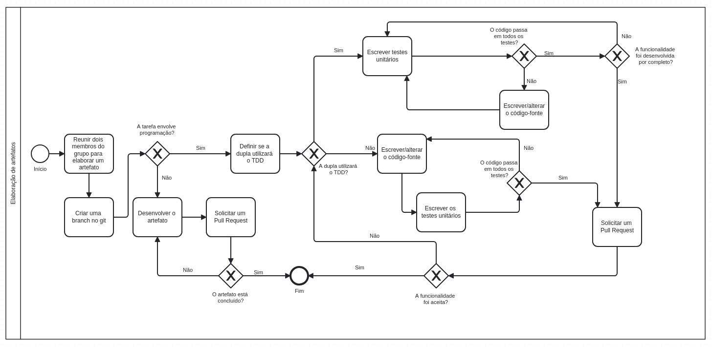

# 1.3. Módulo Modelagem BPMN

## Introdução

## Modelagem BPMN - Metodologia

A metodologia escolhida foi um híbrido de várias características e atividades das metodologias RUP, SCRUM, XP, Kanban e Atomic Design. 

### Características ou atividades que vêm do RUP

O processo será iterativo e incremental. As 4 fases do RUP nos guiarão como um framework de escala maior ao longo do projeto. Basicamente, várias atividades do Ciclo de Desenvolvimento de Software serão feitas simultaneamente. Contudo, cada fase tem uma ênfase diferente. As fases são:

1. **Iniciação**: definir o escopo do projeto e sua viabilidade.
2. **Elaboração**: refinar os requisitos elicitados e estabelecer uma base arquitetural.
3. **Construção**: desenvolver o software.
4. **Transição**: testar, corrigir bugs e implantar (deploy) o software.

Na figura 1, vemos de maneira gráfica como o RUP funciona como um framework geral de desenvolvimento do projeto.

    
        
<b>Figura 1:</b> Fases do RUP

    

<b>Fonte:</b> <a href="https://www.infoescola.com/engenharia-de-software/rup/">InfoEscola</a>, 2024

### Características ou atividades que vêm do SCRUM

Utilizaremos a prática de Sprint Planning, no início de cada iteração, para definir as atividades que realizaremos ao longo dela. Nessa mesma reunião, realizaremos um Sprint Retrospective, para que vejamos o que fizemos de bom e ruim ao longo da iteração. Além disso, adotaremos os artefatos de Sprint Backlog e Product Backlog para que tenhamos melhor controle das atividades e do que foi entregue.

A figura 2 é um model em BPMN que indica como as reuniões vão proceder.

    
        
<b>Figura 2:</b> BPMN das atividades que vêm do SCRUM

    

<b>Fonte:</b> <a href="https://github.com/lucasqueiroz23">Lucas Queiroz</a>, 2024

### Características ou atividades que vêm do XP

Realizaremos Pair Programming para desenvolver os artefatos (sejam eles de código-fonte ou documentação). Além disso, os membros do grupo são livres para utilizarem o método de TDD, caso queiram. Na figura 3, abaixo, consta o BPMN desenvolvido para modelar o workflow geral de desenvolvimento de artefatos.

    
        
<b>Figura 3:</b> BPMN do Workflow de desenvolvimento de artefatos

    

<b>Fonte:</b> <a href="https://github.com/lucasqueiroz23">Lucas Queiroz</a>, <a href="https://github.com/GuilhermeB12"> Guilherme Brito </a> e <a href="https://github.com/zenildavieira"> Zenilda Vieira </a>, 2024

### Características ou atividades que vêm do Kanban

Utilizaremos um Kanban Board para definir o andamento das atividades que nos propomos a realizar. Na figura 4, abaixo, está o BPMN que indica o fluxo do Kanban.

    
        
<b>Figura 4:</b> BPMN do Kanban

    

<b>Fonte:</b> <a href="https://github.com/lucasqueiroz23">Lucas Queiroz</a>, <a href="https://github.com/GuilhermeB12"> Guilherme Brito </a> e <a href="https://github.com/zenildavieira"> Zenilda Vieira </a>, 2024

### Características ou atividades que vêm do Atomic Design

Os protótipos e telas desenvolvidos serão produzidos utilizando as etapas do Atomic Design. Ou seja: de maneira modular, os componentes de uma página serão pensados e unidos, seguindo os conceitos de átomo, molécula, organismo, template e página.

## Histórico de Versões

|Versão|Data|Descrição|Autor|Revisor|
|:----:|----|---------|:-----:|:-------:|
|`1.0`|31/10/2024|Adição inicial do BPMN de Metodologia|[Lucas Queiroz](https://github.com/lucasqueiroz23)   [Guilherme Brito](https://github.com/GuilhermeB12)|[Zenilda Vieira](https://github.com/zenildavieira) |
|`1.1`|01/11/2024|Adição de BPMN do SCRUM|[Lucas Queiroz](https://github.com/lucasqueiroz23) | [Zenilda Vieira](https://github.com/zenildavieira)   [Guilherme Brito](https://github.com/GuilhermeB12)|
|`1.2`|01/11/2024|Adição de BPMN do Workflow de desenvolvimento de artefatos|[Lucas Queiroz](https://github.com/lucasqueiroz23) | [Zenilda Vieira](https://github.com/zenildavieira)   [Guilherme Brito](https://github.com/GuilhermeB12)|
|`1.3`|02/11/2024|Adição de BPMN do Kanban|[Lucas Queiroz](https://github.com/lucasqueiroz23)   [Zenilda Vieira](https://github.com/zenildavieira)   [Guilherme Brito](https://github.com/GuilhermeB12)| |
